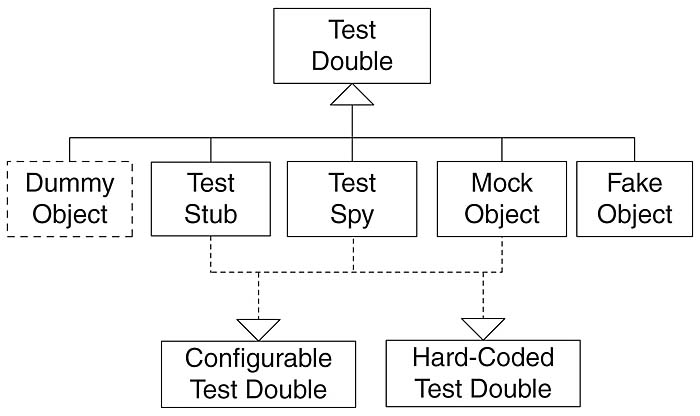

## 테스트 더블(*Test Double*)이란?

[xUnit Test Patterns](http://www.acornpub.co.kr/book/xunit)의 저자인 제라드 메스자로스(*Gerard Meszaros*)가 만든 용어로 테스트를 진행하기 어려운 경우 이를 대신해 테스트를 진행할 수 있도록 만들어주는 객체를 말한다.

> 영화 촬영 시 위험한 역할을 대신하는 스턴트 더블에서 비롯되었다.

예를 들어 우리가 데이터베이스로부터 조회한 값을 연산하는 로직을 구현했다고 하자. 해당 로직을 테스트하기 위해선 항상 데이터베이스의 영향을 받을 것이고, 이는 데이터베이스의 상태에 따라 다른 결과를 유발할 수도 있다.

이렇게 테스트하려는 객체와 연관된 객체를 사용하기가 어렵고 모호할 때 대신해 줄 수 있는 객체를 **테스트 더블**이라 한다.



<br/>

## 테스트 더블의 종류

테스트 더블은 크게 **Dummy**, **Fake**, **Stub**, **Spy**, **Mock**으로 나눈다.

### 1. Dummy

- 가장 기본적인 테스트 더블이다.
- 인스턴스화 된 객체가 필요하고, 해당 객체의 기능까지 필요하지 않은 경우에 사용한다.
- Dummy 객체의 메서드가 호출되었을 때 정상 동작은 보장하지 않는다.
- 객체는 전달되지만 사용되지 않는 객체이다.

정리하면 인스턴스화된 객체가 필요해서 구현한 가짜 객체일 뿐이고, 생성된 Dummy 객체는 정상적인 동작을 보장하지 않는다.

간단한 예시를 통해 알아보자.

```java
public interface PringWarning {
    void print();
}
```

```java
public class PrintWarningDummy implements PrintWarning {
    @Override
    public void print() {
        // 아무런 동작을 하지 않는다.
    }
}
```

만약 테스트를 하려는 객체에서 PrintWarning 인터페이스를 구현한 구현체를 필요로 하지만, 실제로 테스트를 할 로직에서는 해당 구현체의 동작은 전혀 필요로 하지 않을 수 있다.

PrintWarning이 프로덕션 환경에서 로그용 경고를 띄워주는 역할을 하는 인터페이스라면 테스트 환경에서는 전혀 필요없기 때문이다. 이런 경우 해당 객체의 메서드인 `print()` 는 아무런 동작을 하지 않아도 테스트에는 영향을 미치지 않는다.

이처럼 동작하지 않아도 테스트에는 영향을 미치지 않는 객체를 Dummy 객체라고 한다.

### 2. Fake

- 복잡한 로직이나 객체 내부에서 필요로 하는 다른 외부 객체들의 동작을 단순화하여 구현한 객체이다.
- 동작의 구현을 가지고 있지만 실제 프로덕션에는 적합하지 않은 객체이다.

정리하면 동작은 하지만 실제 사용되는 객체처럼 정교하게 동작하지는 않는 객체를 말한다.

간단한 예시를 통해 알아보자.

```java
@Entity
public class User {
    @Id
    private Long id;
    private String name;
    
    protected User() {}
    
    public User(Long id, String name) {
        this.id = id;
        this.name = name;
    }
    
    public Long getId() {
        return this.id;
    }
    
    public String getName() {
        return this.name;
    }
}
```

```java
public interface UserRepository {
    void save(User user);
    User findById(long id);
}
```

```java
public class FakeUserRepository implements UserRepository {
    private Collection<User> users = new ArrayList<>();
    
    @Override
    public void save(User user) {
        if (findById(user.getId()) == null) {
            user.add(user);
        }
    }
    
    @Override
    public User findById(long id) {
        for (User user : users) {
            if (user.getId() == id) {
                return user;
            }
        }
        return null;
    }
}
```

만약 테스트를 해야하는 객체가 데이터베이스와 연관이 되어있을 수 있다.

그럴 경우 실제 데이터베이스를 연결해서 테스트를 해야 하지만, 이처럼 가짜 데이터베이스 역할을 하는 FakeUserRepository를 만들어 테스트 객체에 주입해주면 데이터베이스에 의존하지 않으면서 동일하게 동작을 하는 가짜 데이터베이스를 가질 수 있다.

이처럼 실제 객체와 동일한 역할을 하도록 만들어 사용하는 객체가 Fake이다.

### 3. Stub

- Dummy 객체가 실제로 동작하는 것 처럼 보이게 만들어 놓은 객체이다.
- 인터페이스 또는 기본 클래스가 최소한으로 구현된 상태이다.
- 테스트에서 호출된 요청에 대해 미리 준비해둔 결과를 제공한다.

정리하면 테스트를 위해 프로그래밍된 내용에 대해서만 준비된 결과를 제공하는 객체이다.

간단한 예시를 통해 살펴보자.

> 위에서 사용한 UserRepository 인터페이스를 사용하겠다.

```java
public class StubUserRepository implements UserRepository {
    // ...
    @Override
    public User findById(long id) {
        return new User(id, "Test User");
    }
}
```

위의 코드처럼 StubUserRepository는 `findById()` 메서드를 사용하면 언제나 동일한 id값에 **Test User**라는 이름을 가진 User 인스턴스를 반환받는다.

테스트 환경에서 User 인스턴스의 name을 Test User만 받기를 원하는 경우 이처럼 동작하는 객체(UserRepository의 구현체)를 만들어 사용할 수 있다.

물론 이러한 방식의 단점은 테스트가 수정될 경우(`findById()` 메서드가 반환해야 할 값이 변경되야 할 경우) Stub 객체도 함께 수정해야 하는 단점이 있다.

우리가 테스트에서 자주 사용하는 Mockito 프레임워크도 Stub와 같은 역할을 해준다.

이처럼 테스트를 위해 의도한 결과만 반환되도록 하기 위한 객체가 Stub이다.

### 4. Spy

- Stub의 역할을 가지면서 호출된 내용에 대해 약간의 정보를 기록한다.
- 테스트에서 확인하기 위한 정보이다.
- 테스트 더블로 구현된 객체에 자기 자신이 호출 되었을 때 확인이 필요한 부분을 기록하도록 구현한다.

정리하면 데스트 더블 객체를 구현하고 해당 객체가 호출되는 경우, 상태를 확인하는 객체를 말한다.

간단한 예시를 통해 살펴보자.

```java
public class MailingService {
    private Collection<Mail> mails = new ArrayList<>();
    
    public void sendMail(Mail mail) {
        mails.add(mail);
    }
    
    public long sentMailCount() {
        return mails.size();
    }
}
```

MailingService는 메일을 보낼 때마다 보낸 메일을 저장하고 몇 번 보냈는지를 확인할 수 있다.

이처럼 자기 자신이 호출된 상황을 확인할 수 있는 객체가 Spy이다.

이 또한 Mockito 프레임워크의 `verify()` 메서드가 같은 역할을 한다.

### 5. Mock

- 호출에 대한 기대를 명세하고 내용에 따라 동작하도록 프로그래밍 된 객체이다.

우테코에서 미션을 진행하면서 사용한 Mockito 프레임워크가 대표적인 Mock 프레임워크라 볼 수 있다.

SpringBoot에서의 Mockito 프레임워크의 사용 방법을 통해 Mock을 살펴보자.

> 위에서 사용한 UserRepository 인터페이스를 사용하겠다.

```java
@ExtendWith(MockitoExtension.class)
public class UserServiceTest {
    @Mock
    private UserRepository userRepository;
    
    @Test
    void test() {
        when(userRepository.findById(anyLong())).thenReturn(new User(1, "Test User"));
        
        User actual = userService.findById(1);
        assertThat(actual.getId()).isEqualTo(1);
        assertThat(actual.getName()).isEqualTo("Test User");
    }
}
```

위의 예제를 보면 UserService 인터페이스의 구현체가 `findById()` 메서드를 동작했을 때 어떤 결과를 반환할지를 결정할 수 있다.

> Mockito의 when 메서드에서 anyLong()이 아니라 정확한 값을 사용해서 특정 상황에 대한 테스트를 특정할 수 있다.

<br/>

## 정리하면

프로젝트를 진행하면서, 또 이전에 (우테코에서)미션을 진행하면서도 테스트 프레임워크는 항상 사용해왔다.

하지만 해당 프레임워크가 제공하는 테스트 환경이 어떤 것인지에 대해서 잘 모르고 사용했는데 테스트 더블이 어떤 것들이 있는지, 어떤 역할을 하는지 이번에 알아보았다.

단순한 테스트 환경일 경우 굳이 프레임워크에 의존하지 않고 위의 테스트 더블을 이해하고 직접 구현해서 사용하는 것도 테스트의 의존성을 줄일 수 있는 좋은 방법이 아닐까 싶다.

<br/>

## 참고 링크

> [[Effective Unit Testing] Chap 3. 테스트 더블 - 돼지왕왕돼지](https://aroundck.tistory.com/6109)
>
> [Test Doubles 정리 - Wade](https://brunch.co.kr/@tilltue/55)
>
> [Test Double(테스트 더블) 알아보기 - 봄석](https://beomseok95.tistory.com/295)
>
> [테스트 더블 - beonit](https://velog.io/@beonit/%ED%85%8C%EC%8A%A4%ED%8A%B8-%EB%8D%94%EB%B8%94)
>
> [단위 테스트 케이스와 테스트 더블 - Yoo Young-mo](https://medium.com/@SlackBeck/%EB%8B%A8%EC%9C%84-%ED%85%8C%EC%8A%A4%ED%8A%B8-%EC%BC%80%EC%9D%B4%EC%8A%A4%EC%99%80-%ED%85%8C%EC%8A%A4%ED%8A%B8-%EB%8D%94%EB%B8%94-test-double-2b88cccd6a96)