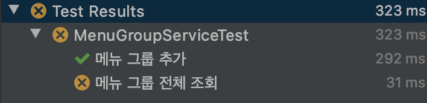
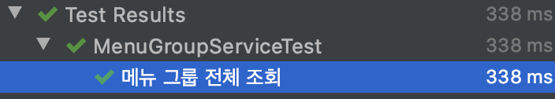
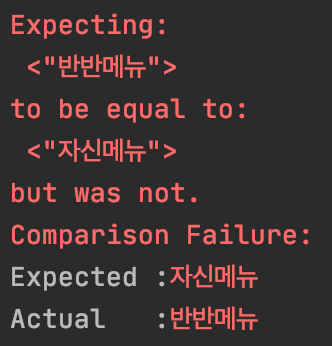

잘 작성된 테스트는 프로덕션 코드에 자신감과 안정감을 불어넣어 준다.  
안정감을 주는 테스트는 같은 코드 아래에서라면 언제나 일관된 결과를 내려줄 것이다.  

우리는 그런 믿음을 마음 한 쪽에 지닌 채로 테스트 코드를 작성한다.  

```java
@SpringBootTest
class MenuGroupServiceTest {

    // ... 생략

    @DisplayName("메뉴 그룹 추가")
    @Test
    void create() {
        MenuGroup menuGroup = MenuGroup.builder()
            .name("반반메뉴")
            .build();
        MenuGroup created = menuGroupService.create(menuGroup);

        assertThat(created.getId()).isNotNull();
    }

    @DisplayName("메뉴 그룹 전체 조회")
    @Test
    void list() {
        MenuGroup menuGroup1 = MenuGroup.builder()
            .name("반반메뉴")
            .build();
        MenuGroup menuGroup2 = MenuGroup.builder()
            .name("자신메뉴")
            .build();
        menuGroupService.create(menuGroup1);
        menuGroupService.create(menuGroup2);

        List<MenuGroup> list = menuGroupService.list();

        assertAll(
            () -> assertThat(list.get(0).getName()).isEqualTo(menuGroup1.getName()),
            () -> assertThat(list.get(1).getName()).isEqualTo(menuGroup2.getName())
        );
    }
}
```

`MenuGroup` 객체를 추가하고, 전체를 조회하는 코드에 대한 테스트다.  

각각의 테스트도 잘 통과하고, 프로그램도 정상적으로 돌아간다.  
그래도 혹시 모르니, 마지막으로 전체 테스트를 돌려보고 커밋하도록 하자.


<p style="text-align:center;">( 어...? )</p>

잘만 작동하던 테스트가 갑자기 실패한다.  

마지막 테스트 통과 후 아무것도 건드린 게 없었다.
같은 프로덕션 코드에, 같은 테스트 코드로 돌아가는데 왜인지 실패한다.
뭔가 싶어 실패한 `list` 테스트를 다시 돌려본다.


<p style="text-align:center;">( 이때는 대략 정신이 멍해진다. )</p>

---
## 뭐가 문제지?

정신을 차리고 다시 실패한 테스트를 확인해보자.
테스트가 실패한 원인을 알아낸다면 문제를 해결할 수 있을지도 모른다.


<p style="text-align:center;">( 반반메뉴 != 자신메뉴 )</p>

분명 `반반메뉴`, `자신메뉴` 순서로 추가했는데, 왜 두 번째 메뉴도 `반반메뉴`가 되었을까?

실패할 때와 성공할 때의 차이점을 잘 생각해보자.
뭐가 달랐지?

`list` 테스트를 단독으로 실행할 때는 성공했고, `create` 테스트와 함께 실행하면 실패했다.  
그렇다면 문제는 **단독**으로 테스트를 진행한 것과 다른 테스트와 **함께** 진행한 것의 차이에서 생겼을 것이다.

잠깐 위로 돌아가서 테스트 결과를 보여주는 첫 번째 사진을 보면, `list`(메뉴 그룹 전체 조회) 테스트 이전에 `create`(메뉴 그룹 생성) 테스트가 진행된 걸 볼 수 있다.

다시 `create` 테스트 코드를 보면, `create()` 메소드를 통해 `MenuGroup` 객체를 DB에 저장하고 그 결괏값을 검사하고 있다.
의문의 `반반메뉴`는 이때 저장되었을 것이다.

테스트 실행 순서에 따라서 테스트의 결괏값이 달라진다.
매우 불쾌한 상황이다.

어떻게 하면 테스트를 한 번에 돌려도 다른 테스트의 영향 없이 일정하게 유지될 수 있을까?  
어떻게 하면 각 테스트가 독립적으로 진행될 수 있을까?

함께 테스트 코드를 수정해가며 성공적으로 테스트를 진행해보자.

## 독립적인 테스트 코드 만들기

### 테스트 코드 자체를 잘 짜놓기

테스트 코드에서 문제가 있었으니, 테스트 코드 자체를 잘 짜면 되지 않을까?

각 테스트 코드 자체를 다른 코드에 의존적이지 않게 짜보자.

```java
@DisplayName("메뉴 그룹 전체 조회")
@Test
void list() {
    int defaultSize = menuGroupService.list().size();

    // ... 생략

    List<MenuGroup> list = menuGroupService.list();

    assertAll(
        () -> assertThat(list.get(defaultSize).getName()).isEqualTo(menuGroup1.getName()),
        () -> assertThat(list.get(defaultSize + 1).getName()).isEqualTo(menuGroup2.getName())
    );
}
```

이제 `list` 테스트는 이전 데이터와 상관없이 일정한 결과를 보여줄 것이다.

그렇다면 이제 해결된 걸까?  
아니다, 만족스럽지 않다.

이런 방식을 사용하기 시작하면 앞으로 모든 테스트에 비슷한 역할의 구문을 추가해야 할 것이다.
프로젝트가 커질수록 언제 어떤 영향을 받을지 예측하기도 힘들어진다.
물론 예시의 테스트는 비교적 쉬울지도 모르지만, 일단 전체적으로 각 테스트의 부피가 늘어난다.
이는 가독성을 저해시키고 테스트의 본질을 흐리게 만들 위험이 있다.  

이대로는 안 된다.  
우리는 우리가 편한, 좀 더 쿨하고 멋진 방식을 찾아야 한다.

### @Transactional / @Rollback

### @Before / @After

### @Sql

### @DirtiesContext

[@DirtiesContext](https://docs.spring.io/spring-framework/docs/current/javadoc-api/org/springframework/test/annotation/DirtiesContext.html)을 보면 이런 설명이 쓰여져 있다.

> 테스트와 연관된 ApplicationContext가 더티(dirty)이므로 닫히고 컨텍스트 캐시에서 제거해야 함을 나타내는 테스트 주석입니다.

ApplicationContext의 일부인 DB가 더러워졌으니, 우리도 이 어노테이션을 통해 원하는 것을 얻을 수 있지 않을까?

```java
@SpringBootTest
@DirtiesContext(classMode = ClassMode.AFTER_EACH_TEST_METHOD)
class MenuGroupServiceTest {
    // ... 생략
}
```

하나의 테스트 이후 저장된 캐시를 제거하고 새 ApplicationContext와 동일한 상태로 테스트를 진행할 수 있게 되었다.

DB뿐만 아니라, 