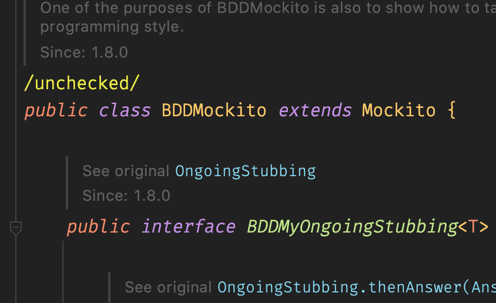

---

> 해당 게시글은 JUnit5.x를 기준으로 작성되었습니다.

우아한테크코스 레벨2 미션 중에 의문이 생긴 적이 있었다.

테스트 코드를 작성하려는데 어떤 부분에서는 mock 객체를 `when().thenReturn()`을 통해 사용하고, 어떤 부분에서는 `given().willReturn()`을 통해 사용하는 것이었다.

import 문을 확인해보니 전자는 `org.mockito.Mockito`를 import하고 후자는 `org.mockito.Mockito`를 import한다.

그렇다면 둘 사이에는 어떤 차이가 존재할까? 성능이나 동작에 차이는 없는 것일까?

<br/>

## Mockito란

Spring은 **DI(*Dependency Injection*)**를 지원해주는데, 이는 객체 간의 의존성을 Spring이 관리해주는 것이다. 그 덕분에 개발자는 의존성 주입을 신경 쓰지 않고 **객체 간의 의존 관계만 잘 고민해서 객체를 설계**하면 된다.

그런데 이런 의존성은 **테스트를 하는 시점**에서 문제를 발생시킨다. 단위 테스트를 작성할 경우 해당 객체에 대한 기능만을 테스트하고 싶은데 **의존성을 가지는 다른 객체에 의해 테스트 결과가 영향을 받을 수 있다는 것**이다.

이렇게 의존을 가지는 객체를 우리가 원하는 동작만 하도록 만든 것이 **Mock 객체**이다.

> 추가적인 내용은 테스트 더블(추후 게시글 링크를 달 예정)을 소개한 글을 참고하시길 바랍니다.

그리고 이런 Mock 객체를 직접 만들고 관리하기란 쉽지 않은데, **Mockito**는 이를 편하게 사용하도록 지원해주는 대표적인 테스트 프레임워크이다.

Spring에서 Mockito를 사용하기 위해서는 `@ExtendWith(MockitoExtention.class)`를 테스트 클래스 상단에 지정해주면 된다. 그러면 `@Mock` 어노테이션을 통해 간단하게 Mock 객체를 만들어 사용할 수 있다.

아래 예시를 통해 Mockito에 대해 간단하게 살펴보자.

```java
import java.util.Collections;
import java.util.List;

public class Skills {
    private List<String> skills;

    public Skills() {
        this.skills = Collections.emptyList();
    }

    public boolean hasSkill() {
        return !skills.isEmpty();
    }
}
```

```java
public class Person {
    private String name;
    private int age;
    private Skills skills;

    public Person(String name, int age, Skills skills) {
        this.name = name;
        this.age = age;
        this.skills = skills;
    }

    public boolean hasSkill() {
        return skills.hasSkill();
    }
}
```

```java
import static org.assertj.core.api.Assertions.*;
import static org.mockito.Mockito.*;

import org.junit.jupiter.api.BeforeEach;
import org.junit.jupiter.api.Test;
import org.junit.jupiter.api.extension.ExtendWith;
import org.mockito.Mock;
import org.mockito.junit.jupiter.MockitoExtension;

@ExtendWith(MockitoExtension.class)
class MockitoPracticeTest {
    @Mock
    private Skills skills;

    private Person person;

    @BeforeEach
    void setUp() {
        person = new Person("wooteco", 2, skills);
    }

    @Test
    void hasSkill_AlwaysTrue() {
        when(skills.hasSkill()).thenReturn(true);

        assertThat(person.hasSkill()).isTrue();
    }
}
```

예제 코드를 확인해보면 Skills 객체를 Mock 객체로 만들고 person 객체는 이를 주입받아 생성되었다.

`hasSkill_AlwaysTrue` 테스트 메서드를 보면 person 객체에 주입된 skills의 `hasSkill()` 메서드가 true를 반환하도록 지정해주었다. 그 결과 해당 테스트는 항상 통과하게 된다.

위와 같이 **Mock 객체에 원하는 동작을 미리 정하고 이를 기반으로 테스트할 수 있다.**

<br/>

## BDD(Behavior-Driven Development)?

지금까지는 Mockito를 통해 Mock 객체를 사용하는 방법을 알아보았다.

그렇다면 이번 글에서 비교할 대상인 **BDDMockito**를 알아봐야 되는데, 그전에 **BDDMockito의 BDD가 뭔지** 알아보자.

**BDD는 *Behavior-Driven Development*의 약자**로 **행위 주도 개발**을 말한다. 테스트 대상의 **상태의 변화를 테스트하는 것**이고, 시나리오를 기반으로 테스트하는 패턴을 권장한다.

여기서 권장하는 기본 패턴은 **Given, When, Then 구조**를 가진다.

이는 테스트 대상이 A 상태에서 출발하며(Given) 어떤 상태 변화를 가했을 때(When) 기대하는 상태로 완료되어야 한다(Then).

앞서 작성한 `hasSkill_AlwaysTrue` 테스트 메서드를 BDD의 기본 패턴으로 바꾸면 어떻게 될까?

```java
@Test
void hasSkill_AlwaysTrue() {
    // given
    when(skills.hasSkill()).thenReturn(true);

    // when
    boolean actual = person.hasSkill();

    // then
    assertThat(actual).isTrue();
}
```

해당 테스트의 시나리오를 **"테스트 대상이 skills가 true만 반환하는 상태에서 출발하며(Given) hasSkill메서드를 실행했을 때(When) 기대하는 상태인 true를 반환하여야 한다(Then)"**와 같이 이해할 수 있을 것이다.

그런데 코드를 보면 given에 위치할 코드에 `Mockito.when()` 메서드가 사용된다.

`// given` 아래에 `when`이 나온다니... 뭔가... 보기가 싫다... 괜히 이해도 잘 안 되는 것 같다. 이를 해결하기 위해 등장한 
것이 **BDDMockito**이다.

<br/>

## BDDMockito!

BDDMockito는 실제로 코드를 살펴보면 **Mockito을 상속**한 클래스이다.



> BDDMockito provides BDD aliases for various Mockito methods, so we can write our Arrange step using given (instead of when), likewise, we could write our Assert step using then (instead of verify). - [Quick Guide to BDDMockito(Baeldung)](https://www.baeldung.com/bdd-mockito)

여러 문서를 확인해보면 Mockito와 동작하는 내용이나 사용하는 방법이 거의 같음을 알 수 있다.

**BDD**를 사용하여 테스트 코드를 작성하는 경우, 좀 더 흐름에 맞게, **시나리오에 맞게 테스트 코드가 읽힐 수 있도록 도와주는(이름을 변경한) 프레임워크**라고 생각해도 될 것 같다.

그럼 앞서 작성한 테스트 코드를 BDDMockito를 사용해서 작성해보자.

```java
@Test
void hasSkill_AlwaysTrue() {
    // given
    given(skills.hasSkill()).willReturn(true);

    // when
    boolean actual = person.hasSkill();

    // then
    assertThat(actual).isTrue();
}
```

BDD 기본 패턴의 given에 해당하는 위치에 이전에 사용한 Mockito의 `then()` 메서드가 아닌 `given()` 메서드가 사용됨을 알 수 있다.

이 외로도 BDD 기본 패턴의 then에서 사용되는 Mockito에서 제공하는 `verify()`도 `then().should()`로 대체될 수 있다.

실제로 Mockito에서 제공한 기능 그대로 사용할 수 있으면서 BDD가 추구하는 **"시나리오에 맞게 테스트 코드가 읽힐 수 있도록"** 도와준다.

<br/>

## 정리하면

BDDMockito는 Mockito가 제공하는 기능과 별반 다르지 않다. 단지 BDD라는 것을 테스트 코드에 도입할 때 기존의 **Mockito**가 가독성을 해치기 때문에 이를 해결하기 위한, **기능은 같지만 이름만 다른 클래스**라고 생각해도 될 것 같다.

TDD와 같이 **BDD**도 새롭게 주목받는 개발 방법론이다. 몇 가지 이유를 살펴보면

- 개발해야 할 기능, 테스트 케이스를 정의하는 공통적인 표준, Template을 따르게 된다.

- 각각의 비즈니스 시나리오는 비즈니스 요구사항을 반영한다.

- 이 시나리오에 기반하여 구현한 기능들과 테스트 케이스들을 통해 비즈니스 요구사항에 대한 커버리지를 가늠할 수 있게 된다.

- BDD에 따라 작성된 비즈니스 요구사항에 대한 내용은 이 자체로도 문서화할 수 있다.

등이 있다.

정리해보면 기존의 일반적인 테스트에서 BDD를 도입하려고 한다면, **BDDMockito를 사용하여 테스트의 전반적인 가독성을 높일 수 있을 것이다!**

<br/>

## 참고 링크

> [BDD스타일을 위한 MockitoBDD - Deep Dive](https://mskwon25.github.io/tdd/MockitoBBD/)
>
> [[TDD] Test code 접근 방식, Mock, Mockito, BDD - DongDD](https://dongdd.tistory.com/165)
>
> [Spring boot starter test와 JUnit5를 이용한 테스트 - 코딩하는 오징어](https://effectivesquid.tistory.com/entry/Spring-Boot-starter-test-%EC%99%80-Junit5%EB%A5%BC-%EC%9D%B4%EC%9A%A9%ED%95%9C-%ED%85%8C%EC%8A%A4%ED%8A%B8) 
>
> [Mockito Test Framework 알아보기 - ausg](https://velog.io/@ausg/Mockito-Test-Framework-%EC%95%8C%EC%95%84%EB%B3%B4%EA%B8%B0)
>
> [BDD(Behavior-Driven Development)에 대한 간략한 정리 - 이상우](https://www.popit.kr/bdd-behaviour-driven-development%EC%97%90-%EB%8C%80%ED%95%9C-%EA%B0%84%EB%9E%B5%ED%95%9C-%EC%A0%95%EB%A6%AC/)